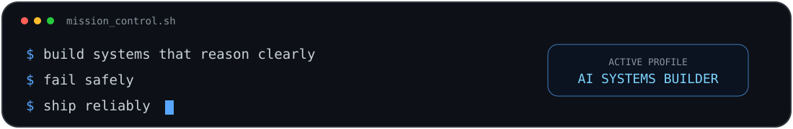

<div align="center">



<br/>

<a href="https://git.io/typing-svg">
  
</a>

<br/>

<a href="https://linkedin.com/in/hammad-asher-b08826329">
  
</a>
<a href="mailto:hammadAsher100@gmail.com">
  
</a>
<a href="https://github.com/hammadAsher100?tab=repositories">
  
</a>

<br/><br/>


</div>

<br/>



<br/>

## `01  Mission Control`

<table>
  <tr>
    <td width="61%" valign="top">

### I build systems, not isolated demos.

My work sits at the intersection of **agentic AI, machine learning, backend architecture, deployment, observability, and trustworthy automation**.

I enjoy engineering systems where models must cooperate with APIs, databases, retrieval layers, validation logic, human review, and operational constraints.

```python
profile = {
    "name": "Hammad Asher",
    "role": "Software Engineering Student and AI Systems Builder",
    "location": "Karachi, Pakistan",
    "university": "Bahria University",
    "core_domains": [
        "Agentic AI",
        "Machine Learning",
        "MLOps",
        "Backend Systems",
        "Multimodal AI",
    ],
    "principle": "Architecture before hype",
}
```

</td>
<td width="39%" valign="top">

### Current Signal

```text
STATUS      ACTIVE
FOCUS       PRODUCTION AI
MODE        BUILD AND SHIP
SPECIALTY   MULTI AGENT SYSTEMS
STACK       PYTHON FIRST
```

### Engineering Priorities

`Reliability` `Explainability`  
`Reproducibility` `Observability`  
`Security` `Human Oversight`

</td>
  </tr>
</table>

<br/>

<div align="center">


</div>

## `02  Proof of Work`

<div align="center">



</div>


<div align="center">


</div>

> ### 🏆 First Place · Agentic AI Track · Techathon 2.0
>
> Designed and built **Project Tartarus**, a cognitive arbitration engine where autonomous agents debate compromised reactor telemetry, apply named physics laws, identify fabricated sensor data, defend against prompt injection, and return a deterministic structured verdict.

<div align="center">

<a href="https://github.com/hammadAsher100/Agentic_ai_Physics_law">
  
</a>

</div>

<br/>

## `03  Flagship Systems`

<table>
  <tr>
    <td width="50%" valign="top">
      <h2>🔴 Project Tartarus</h2>
      <p><strong>Cognitive arbitration under adversarial conditions</strong></p>
      <p>Autonomous agents cross examine reactor telemetry through explicit physical invariants, isolated memory, prompt injection filtering, structured debate rounds, and impartial final arbitration.</p>
      <p>
        
        
        
      </p>
      <a href="https://github.com/hammadAsher100/Agentic_ai_Physics_law">
        
      </a>
    </td>
    <td width="50%" valign="top">
      <h2>🏥 MediMind AI</h2>
      <p><strong>Production oriented healthcare intelligence platform</strong></p>
      <p>Combines disease risk models, SHAP explainability, document analysis, RAG, specialist agents, persistent memory, experiment tracking, monitoring dashboards, and Docker based orchestration.</p>
      <p>
        
        
        
      </p>
      <a href="https://github.com/hammadAsher100/Medimind---Ai-powered-Healthcare-platform">
        
      </a>
    </td>
  </tr>
  <tr>
    <td width="50%" valign="top">
      <h2>🩺 Clinical AI Co Pilot</h2>
      <p><strong>Multimodal decision support with human review</strong></p>
      <p>Unifies chest X ray analysis, heart risk assessment, symptom classification, Grad CAM, SHAP, LLM generated narratives, clinician review, and auditable reporting.</p>
      <p>
        
        
        
      </p>
      <a href="https://github.com/hammadAsher100/Clinic_Ai_Copilot">
        
      </a>
      <a href="https://clinical-ai-copilot-production.up.railway.app">
        
      </a>
    </td>
    <td width="50%" valign="top">
      <h2>🏦 Bank Prediction MLOps</h2>
      <p><strong>Complete model lifecycle engineering</strong></p>
      <p>Includes validation, feature engineering, model comparison, FastAPI serving, Streamlit UI, MLflow tracking, drift monitoring, tests, Docker images, and automated workflows.</p>
      <p>
        
        
        
      </p>
      <a href="https://github.com/hammadAsher100/Bank-Marketing-Customer-Subscription-Prediction-MLOps">
        
      </a>
      <a href="https://huggingface.co/spaces/Unknown213141/BankPrediction">
        
      </a>
    </td>
  </tr>
  <tr>
    <td width="50%" valign="top">
      <h2>📚 Multimodal RAG</h2>
      <p><strong>Grounded semantic search across text and images</strong></p>
      <p>Processes PDFs, Word documents, text files, and images through text and CLIP embeddings, persistent vector storage, semantic retrieval, source attribution, and LLM synthesis.</p>
      <p>
        
        
        
      </p>
      <a href="https://github.com/hammadAsher100/Multimodel_RAG_application">
        
      </a>
    </td>
    <td width="50%" valign="top">
      <h2>🗜️ ZipITSmart</h2>
      <p><strong>Binary safe Huffman compression system</strong></p>
      <p>A Windows Forms application for file, image, and folder compression with archive metadata, dispatcher based processing, decompression support, and compression ratio reporting.</p>
      <p>
        
        
        
      </p>
      <a href="https://github.com/hammadAsher100/ZipIt-Smart">
        
      </a>
    </td>
  </tr>
</table>

<br/>

## `04  Architecture DNA`

<table>
  <tr>
    <td align="center" width="20%"><strong>Reasoning</strong><br/><sub>Agents, routing, tools, memory, evaluation</sub></td>
    <td align="center" width="20%"><strong>Intelligence</strong><br/><sub>ML, deep learning, RAG, multimodal models</sub></td>
    <td align="center" width="20%"><strong>Application</strong><br/><sub>FastAPI, Django, Flask, Streamlit</sub></td>
    <td align="center" width="20%"><strong>Operations</strong><br/><sub>Docker, AWS, CI, monitoring, MLflow</sub></td>
    <td align="center" width="20%"><strong>Trust</strong><br/><sub>SHAP, Grad CAM, HITL, validation, security</sub></td>
  </tr>
</table>

```text
USER
  │
  ▼
INTERFACE
  │
  ▼
API GATEWAY
  │
  ├── AUTHENTICATION
  ├── VALIDATION
  ├── OBSERVABILITY
  │
  ▼
ORCHESTRATION LAYER
  │
  ├── AGENTS
  ├── MODELS
  ├── RETRIEVAL
  ├── MEMORY
  └── TOOLS
  │
  ▼
STRUCTURED AND AUDITABLE OUTPUT
```

<br/>

## `05  Technology Grid`

<div align="center">

### Core Languages


### AI and Data


<br/><br/>


### Backend and Databases


### Infrastructure and Delivery


<br/><br/>


</div>

<br/>

## `06  GitHub Pulse`

<div align="center">



</div>


<div align="center">

<a href="https://github.com/hammadAsher100">
  
</a>
<a href="https://github.com/hammadAsher100">
  
</a>

<br/><br/>


<br/><br/>


<br/>

<picture>
  <source media="(prefers-color-scheme: dark)" srcset="https://raw.githubusercontent.com/hammadAsher100/hammadAsher100/output/github-contribution-grid-snake-dark.svg"/>
  <source media="(prefers-color-scheme: light)" srcset="https://raw.githubusercontent.com/hammadAsher100/hammadAsher100/output/github-contribution-grid-snake.svg"/>
  
</picture>

</div>

<br/>

## `07  Open Channel`

<table>
  <tr>
    <td width="66%" valign="middle">

### Collaboration interests

I am open to technically serious work involving:

`Agentic AI` `RAG` `Multimodal Systems`  
`Machine Learning Products` `MLOps`  
`Backend Intensive AI` `Explainable AI`

</td>
<td width="34%" align="center" valign="middle">

<a href="https://linkedin.com/in/hammad-asher-b08826329">
  
</a>

<br/><br/>

<a href="mailto:hammadAsher100@gmail.com">
  
</a>

</td>
  </tr>
</table>

<br/>

<div align="center">


</div>
